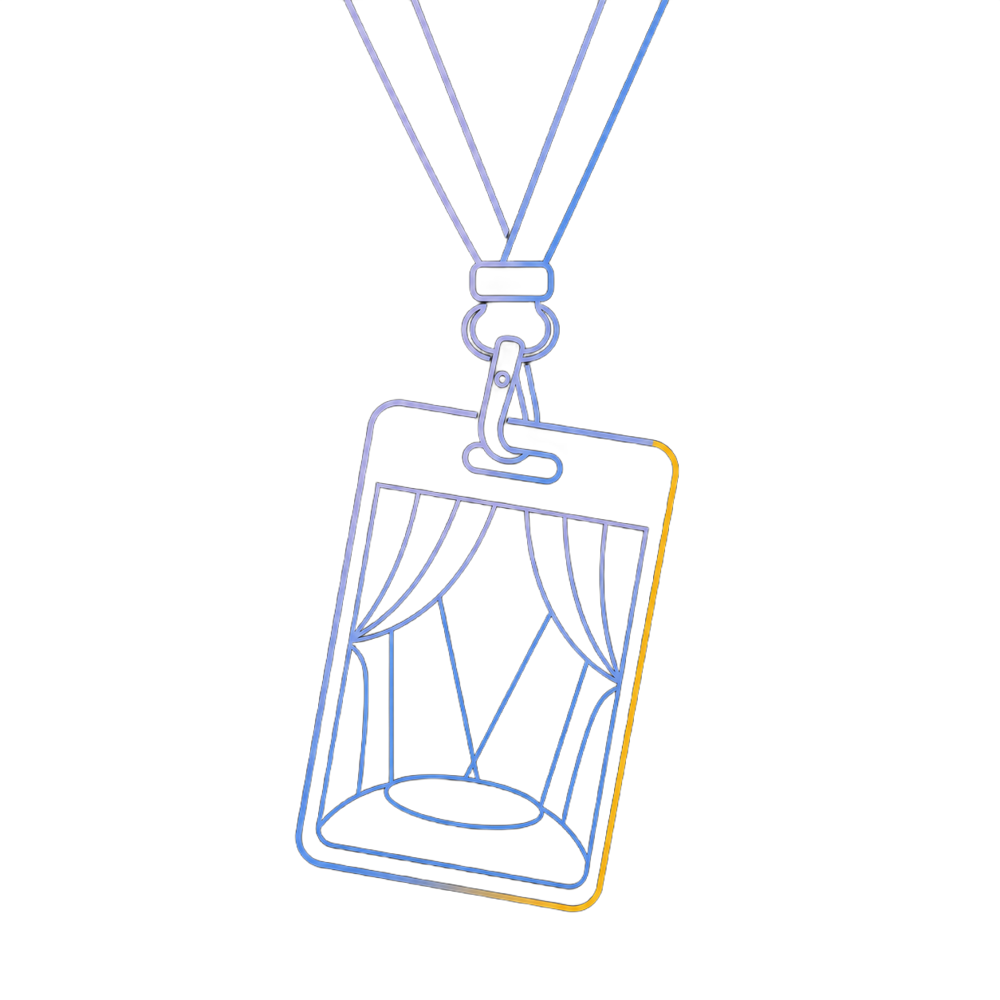
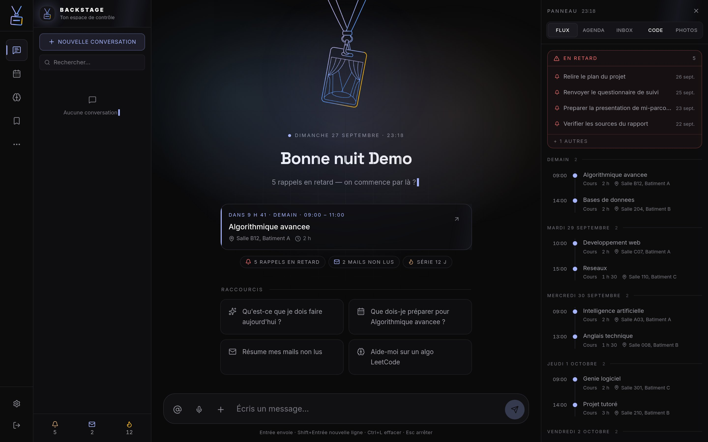
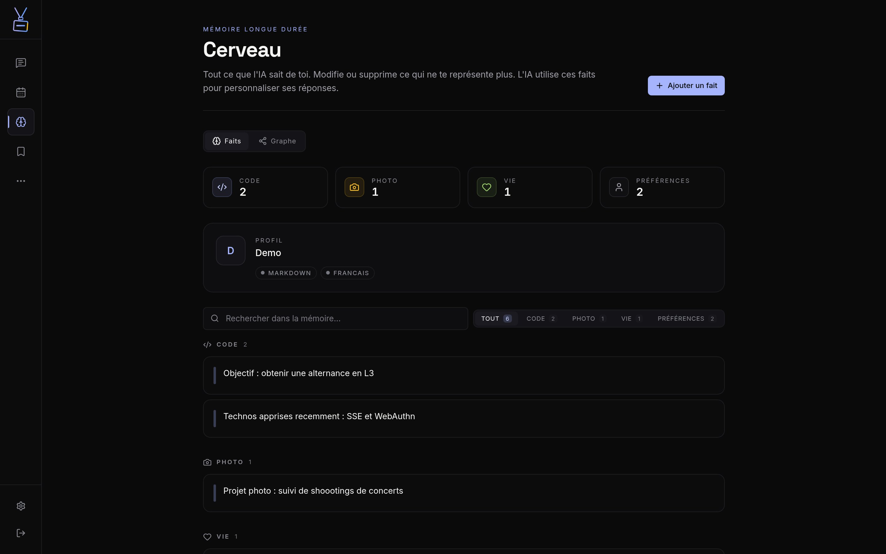
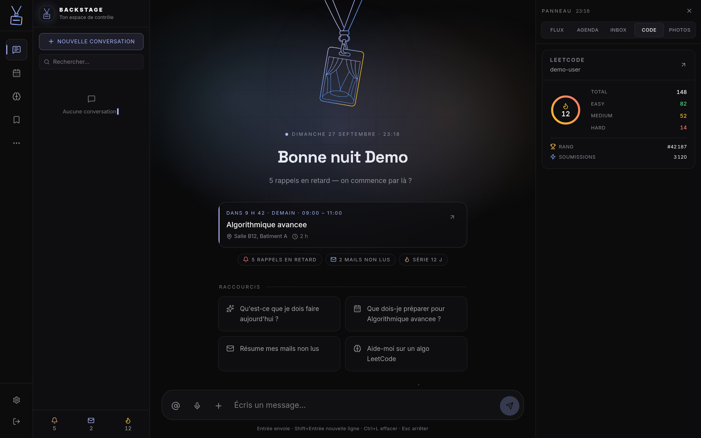

<div align="center">
  
  <h1>BACKSTAGE</h1>
  <p><strong>Second cerveau IA personnel — déployé en production.</strong></p>
  <p>
    Chat IA à mémoire persistante · Passkey (WebAuthn) · Streaming SSE ·
    Rappels synchronisés · Notifications push · PWA installable
  </p>
</div>



> _Un bon outil personnel, c'est comme une bonne photo : si tu remarques l'interface avant l'intention, c'est raté._

**Ce que c'est** — une PWA qui centralise chat IA, mémoire longue, rappels,
agenda, emploi du temps, mails, watch-later et accréditations photo dans une
seule interface éditoriale sombre, installable et utilisable hors-ligne.

| | |
| --- | --- |
| **Échelle** | 32 000 lignes · 25 pages · 34 routes API · 20 Server Actions |
| **Qualité** | 46 fichiers de tests (Vitest) + E2E Playwright |
| **Auth** | Passkey WebAuthn + JWT, OAuth Google & Microsoft |
| **Déploiement** | Build standalone Next.js sur hébergement mutualisé (cPanel) |
| **Données** | Fichiers JSON avec écritures atomiques, verrous et rotation de backups |

---

## 🧠 Ce que c'est

BACKSTAGE n'est pas un dashboard de plus. C'est un espace de travail unique où
l'IA conversationnelle, la mémoire persistante et les outils du quotidien (Gmail,
Calendar, LeetCode, concerts) se répondent entre eux.

- **Chat IA streaming** (OpenAI / Anthropic) avec raisonnement visible, appels d'outils en direct
- **Mémoire** : l'IA se souvient de faits, et tu peux les corriger, oublier, explorer
- **Rappels** natifs navigateur + brief quotidien automatique
- **Watch-later** : liens, articles, vidéos YouTube avec extraction d'aperçu (og:image)
- **Agenda & Mail** : intégration Google via OAuth
- **Accréditations** : gestion des accréditations photo concerts (suit mes shootings)
- **Recherche web** : Brave Search avec fallback DuckDuckGo (outils IA du chat)
- **PWA** : installable, fonctionne hors-ligne, service worker, manifest
- **Thèmes & accent** : dark/light, couleur d'accent personnalisable, picker de thème

---

## 💻 Stack

| Frontend                     | Backend / Runtime          | Data / Infra                | Auth                              |
| ---------------------------- | -------------------------- | --------------------------- | --------------------------------- |
|  |  |  |  |
|  |  |  | -34a853?style=flat-square&logo=webauthn&logoColor=white) |
|  |  |  | |
| |  | | |

---

## 🌟 Ce que je montre

| | |
| --- | --- |
|  |  |
| **La mémoire longue** — l'IA retient des faits, tu les corriges ou les oublies | **Le panneau de contexte** — Flux, agenda, inbox, code et photos dans une seule colonne |

- **Tout dans une seule vue** : chat à gauche, agenda / mail / LeetCode / mémoire à droite, aucune page qui coupe le flux
- **IA qui agit vraiment** : `fetch_page`, `fetch_page_title`, `search_web`, `remember_fact` — pas du texte dans un coin
- **Pensé pour le quotidien** : raccourcis clavier (`⌘K` palette, `?` aide), PWA installable, fonctionne en 3G
- **Le détail, c'est l'intention** : un loader avant que l'IA ne « pense », un dot animé pendant qu'elle raisonne, un toast quand elle touche au calendrier

➜ **[Voir le code en action](#installation)** (clone + `bun dev`)

---

## ⚡ Décisions techniques notables

1. **Next.js 16 App Router + React 19** — Server Actions pour la mémoire et les rappels, Server Components pour les vues, streaming IA via Route Handler SSE
2. **`googleapis` → `google-auth-library`** — moins de surface, plus de contrôle sur les tokens et le refresh
3. **Cache client TTL + stale-while-revalidate** — pas de re-fetch agressif, données toujours fraîches sous 60s
4. **Service Worker maison** — pas de Workbox, stratégie `cache-first` pour le shell, `network-first` pour les API
5. **Manifeste + icônes SVG** — pas de PNG à générer, scalables à toutes les tailles
6. **Pas de base de données** — pour l'instant, fichiers JSON + mémoire serveur. C'est personnel, c'est assumé.

> Un bon outil personnel, c'est un outil qu'on peut ouvrir à 2h du matin
> sans se demander si la dépendance de gauche va casser.

---

## 🧩 Trois problèmes réels, et ce qu'ils m'ont appris

Ce sont les bugs qui m'ont le plus coûté de temps — donc les plus instructifs.

**1. Un bundle edge qui embarquait le système de fichiers.**
Mon proxy d'authentification plantait au démarrage en production avec
`__import_unsupported is not defined`. La cause : un import **statique** de
`dotenv` dans `instrumentation.ts`, qui embarque `fs`, `path`, `os` et
`crypto` dans le bundle edge — alors qu'un runtime edge n'a pas de système
de fichiers. Corrigé par des imports dynamiques gardés par une condition
`NEXT_RUNTIME === "nodejs"`.
*Ce que j'en retiens : sur un runtime edge, ce que tu importes statiquement
finit dans le bundle, même si tu ne l'exécutes jamais.*

**2. Playwright fonctionnait en local, mort en production.**
La synchro de l'emploi du temps passait au green sur ma machine et plantait
une fois déployé. L'hébergement de prod est un cPanel en `--production`,
sans Chromium : toute solution Playwright y était condamnée. J'ai réécrit le
scraping en `fetch` HTTP pur (CSRF → login → skip CVEC → décodage JSON de
l'attribut HTML).
*Ce que j'en retiens : le meilleur test, c'est d'essayer sur la
production avant d'y déployer.*

**3. Une API qui répond HTTP 200 en échouant.**
Mes compteurs LeetCode affichaient quatre zéros. Trois erreurs distinctes :
les compteurs ne sont pas sur `/{pseudo}` (mais sur `/{pseudo}/solved`), un
pseudo inconnu répond **200** avec un tableau `errors` dans le corps, et
`ranking: 5000001` signifie « non classé », pas un numéro.
*Ce que j'en retiens : HTTP 200 ne veut pas dire succès, et un champ bien
nommé ne signifie pas ce qu'on croit.*

---

## 🚀 Installation

```bash
git clone https://github.com/MattiaPARRINELLO/backstage.git
cd backstage
bun install
cp .env.example .env.local   # renseigner IA_API_KEY, AUTH_SECRET, OAuth Google/Microsoft, VAPID…
bun dev
```

L'app démarre sur [http://localhost:3000](http://localhost:3000).

### Variables d'environnement

| Var                         | Rôle                                                       |
| --------------------------- | ---------------------------------------------------------- |
| `NEXT_PUBLIC_API_URL`       | Base URL de l'API IA (provider OpenCode)                   |
| `IA_API_KEY`                | Clé API du provider IA                                     |
| `AUTH_SECRET`               | Signe les JWT de session (passkey + Google + Microsoft)    |
| `GOOGLE_CLIENT_ID`          | OAuth Google (Calendar + Gmail)                            |
| `GOOGLE_CLIENT_SECRET`      | OAuth Google                                               |
| `GOOGLE_REDIRECT_URI`       | Callback OAuth Google                                      |
| `MICROSOFT_CLIENT_ID`       | OAuth Microsoft (sync reminders → Microsoft To Do)         |
| `MICROSOFT_CLIENT_SECRET`   | Valeur du secret Microsoft (pas le Secret ID)              |
| `MICROSOFT_REDIRECT_URI`    | Callback OAuth Microsoft                                   |
| `OPENWEATHERMAP_API_KEY`    | Météo (brief quotidien, préparation concert)               |
| `BRAVE_SEARCH_API_KEY`      | Recherche web Brave (optionnel, fallback DuckDuckGo)       |
| `NEXT_PUBLIC_VAPID_PUBLIC_KEY` | Paire VAPID Web Push (notifications)                    |
| `VAPID_PRIVATE_KEY`         | Paire VAPID Web Push                                       |
| `VAPID_SUBJECT`             | Contact mailto pour Web Push                               |
| `CRON_SECRET`               | Protège `/api/cron/*` (obligatoire en prod)                |
| `SETUP_TOKEN`               | Bootstrap one-time du premier passkey (à retirer ensuite)  |

### Commandes

```bash
bun dev              # dev server
bun run build        # production build
bun run start        # production server
bun run lint         # eslint (flat config)
bunx tsc --noEmit    # type-check
bun run test         # vitest (unit tests)
bun run test:watch   # vitest (watch)
bun run test:e2e     # playwright (e2e)
bun run analyze      # build + bundle-analyzer
bun run cron:reminders   # déclencheur reminders (scripts/cron-scheduler.ts)
bun run cron:daily-brief # déclencheur brief du matin
bun run reset:passkey    # reset des passkeys enregistrées
```

---

## 🗂️ Structure

```
app/
  ├─ (chat)            # Chat IA + AppShell
  ├─ actions/          # Server Actions (une par domaine : memory, reminders, brain…)
  ├─ api/              # Route handlers (SSE chat, auth, google, cron, push…)
  ├─ brain/            # Mémoire (faits, CRUD)
  ├─ reminders/        # Rappels + notifications natives
  ├─ schedule/         # Emploi du temps CESAR (sync auto, notif -30 min)
  ├─ watch-later/      # Liens, articles, vidéos
  ├─ calendar/         # Google Calendar
  ├─ gmail/            # Gmail
  ├─ activity/         # Journal d'activité
  ├─ search/           # Recherche web + mémoire
  ├─ accreditations/   # Accréditations photo
  ├─ settings/         # Thème, accent, profil
  └─ …                 # photos, focus, leetcode, week, notif, offline…
components/
  ├─ chat/             # ChatView, streaming, tool calls
  ├─ layout/           # AppShell, Chrome, ContextPanel
  ├─ ui/               # Primitives (Markdown, CommandPalette, KeyboardShortcuts, AccentPicker…)
  └─ widgets/          # Calendar, Gmail, LeetCode, Accreditations
lib/
  ├─ storage-core.ts   # Moteur JSON : écritures atomiques, verrous, backups
  ├─ storage/          # CRUD par domaine (reminders, memory, concerts, gallery…)
  ├─ types/            # Types métier par domaine (ré-exportés via types.ts)
  ├─ ai-providers.ts   # Dispatch OpenAI/Anthropic (barrel)
  ├─ ai-providers/     # Adapteurs openai.ts, anthropic.ts, types.ts, config.ts
  ├─ web.ts            # Recherche web, meta de pages, garde-fou anti-SSRF
  ├─ google-client.ts  # OAuth Google + refresh tokens
  ├─ microsoft-client.ts # OAuth Microsoft + Graph todo
  ├─ session-core.ts   # JWT session (Node fs)
  ├─ session-edge.ts   # JWT session (edge runtime)
  ├─ cache.ts          # TTL, SWR, optimistic updates
  ├─ server-cache.ts   # Cache côté serveur (process memory)
  ├─ daily-brief.ts    # Brief du matin
  └─ offline.ts        # IndexedDB + queue offline
public/
  ├─ sw.js             # Service worker
  ├─ manifest.json     # PWA manifest
  └─ icons/            # SVG icons
scripts/               # cron-scheduler, reset-passkey, QA (playwright)
```

---

## 📬 Me retrouver

| Contact               | Lien                                                               |
| --------------------- | ------------------------------------------------------------------ |
| Email                 | [contact.mprnl@gmail.com](mailto:contact.mprnl@gmail.com)          |
| GitHub                | [github.com/MattiaPARRINELLO](https://github.com/MattiaPARRINELLO) |
| Portfolio développeur | [dev.mprnl.fr](https://dev.mprnl.fr)                               |
| Portfolio photo       | [photo.mprnl.fr](https://photo.mprnl.fr)                           |
| Instagram photo       | [instagram.com/mattia_jpeg](https://instagram.com/mattia_jpeg)     |
